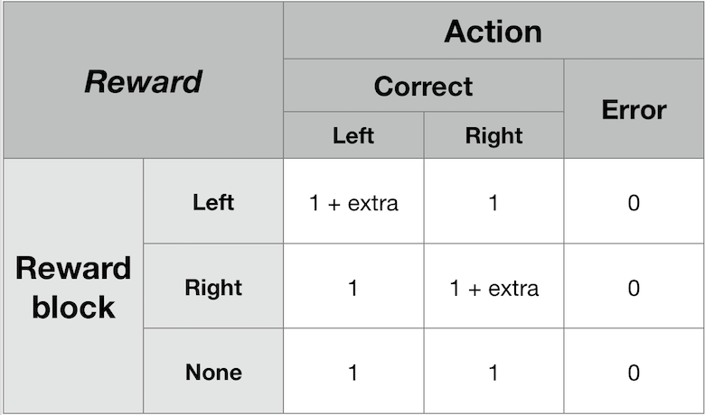
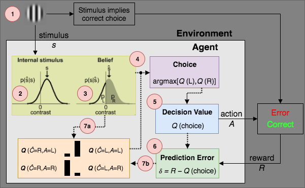

# POMDP

Implementing a reinforcement learning algorithm based upon a _partially observable Markov decision process_. 

* [The task](#the-task)
* [The model](#the-model)
* [Running the code](#running-the-code)
* [References](#references)

## The task

Here the agent will be presented with a two-alternative forced decision task. Over a number of trials the agent will be able to choose and then perform an action based upon a given stimulus. The stimulus values range from -0.5 to 0.5. When the stimulus value is less than 0, the agent should choose Left to make a correct decision, and when the stimulus value is greater than 0 the agent should choose Right to make a correct decision. If the stimulus value is 0, the correct decision is randomly assigned to be either left or right for the given trial, and the agent will be rewarded accordingly.

The agent is rewarded in an asymmetric manner. For some trials, the agent receives an additional reward for making a left correct action. For the remaining trials, the agent receives an additional reward for making a right correct action. The trials are presented to the agent in blocks.

#### Task parameters

This code allows the user to choose some of the parameters of the task. For instance,

- the number of trials
- the number of reward blocks
- options for reward blocks ('right','left' or 'none', where 'none' is optional)
- stimulus values

## The model

Note that this model implements a POMDP with Q-values. Q-values are a quantification of the agent's value of choosing a particular action. Q-values are updated with every trial based upon the reward received. The higher the Q-value, the higher the agent currently values making a particular action.

1. At the beginning of each trial, the agent receives some stimulus, s. The larger the absolute value of stimulus, the clearer the stimulus appears to the agent.

2. In order to model the agent having an imperfect perception of the stimulus, noise is added to the stimulus value. The perceived stimulus value is sampled from a normal distribution with mean s (the stimulus value) and standard deviation, sigma. The value of sigma is a parameter of the model.

3. Using its perceived, noisy value of the stimulus, the agent then forms a belief as to the correct side of the stimulus. The agent calculates the probability of the stimulus being on a given side by calculating the cumulative probability of a normally distributed random variable (with mean noisy-stimulus-value and standard deviation sigma, as above) at zero.

4. The agent then combines its belief as to the current side of the stimulus with its stored Q-values.

5. The agent chooses either a left or right action, and receives the appropriate reward. This reward depends firstly on whether the agent has chosen the correct side, and secondly which is the current reward block. The current reward block will dictate whether the agent receives an additional reward for a correct action. The value of this additional reward is a second parameter of the model.

6. The agent calculates the error in its prediction. This is equivalent to the reward minus the Q-value of the action taken.

7. The prediction error, the agent's belief and the agent's learning rate (a third parameter of the model) are then used to update the Q-values for the next iteration. 

 

#### Model parameters

- sigma, the noise added to the agent's perception of the stimulus and the standard deviation in the agent's belief distribution.
- the value of the additional reward.
- the learning rate.

## Running the code

The file 'Main.m' is the file which runs the model. The code runs as is, and will plot the results.

The first two sections of the allow the user to alter both the task parameters and the model parameters. The third section generates random stimulus values and reward blocks to be fed to the agent. The fourth section implements the POMDP in with the function 'RunPOMDP'. The final section plots the results.

## References

The ideas used to build the model implemented here are largely drawn from 
* [_Reinforcement Learning: An Introduction_](http://people.inf.elte.hu/lorincz/Files/RL_2006/SuttonBook.pdf) by Richard Sutton and Andrew Barto
* [_Planning and acting in partially observable stochastic domains_](https://doi.org/10.1016/S0004-3702(98)00023-X) by Kaelbling et al. (1998)

Terminology and the majority of the notation are also taken from these sources.

The task implemented is based upon
* [_Midbrain Dopamine Neurons Signal Belief in Choice Accuracy during a Perceptual Decision_](https://doi.org/10.1016/j.cub.2017.02.026) by Lak et al. (2017)
* [_High-yield methods for accurate two-alternative visual psychophysics in head-fixed mice_](https://doi.org/10.1016/j.celrep.2017.08.047) by Burgess et al. (2017)

